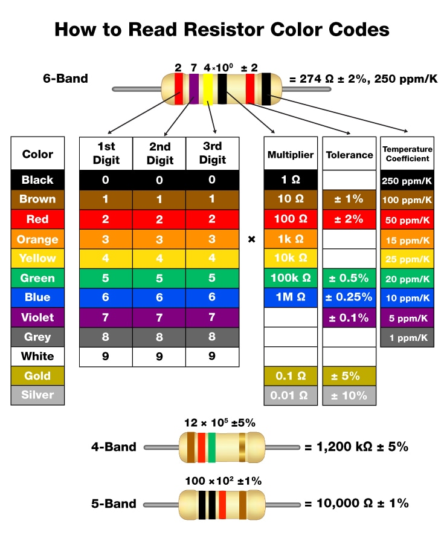

# React + Vite

### `Resistors calculators`

calculate the value base on the colors
and here you can see

https://static4.arrow.com/-/media/arrow/images/miscellaneous/h/how-to-read-resistor-color-codes.jpg

